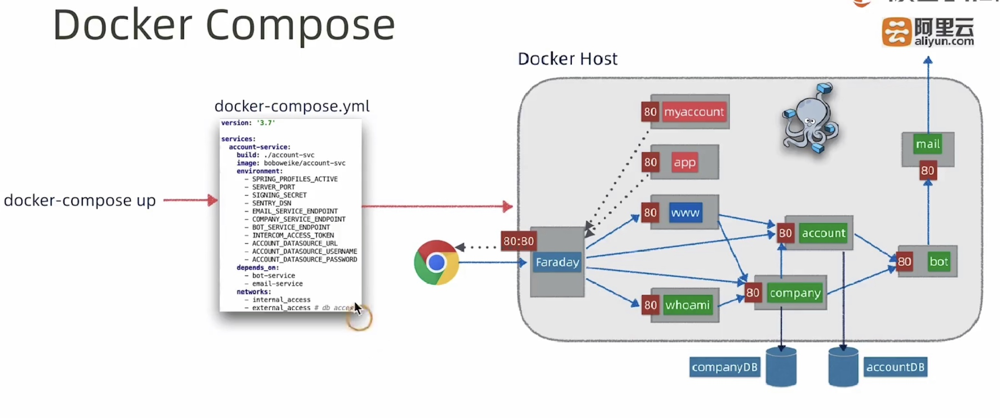
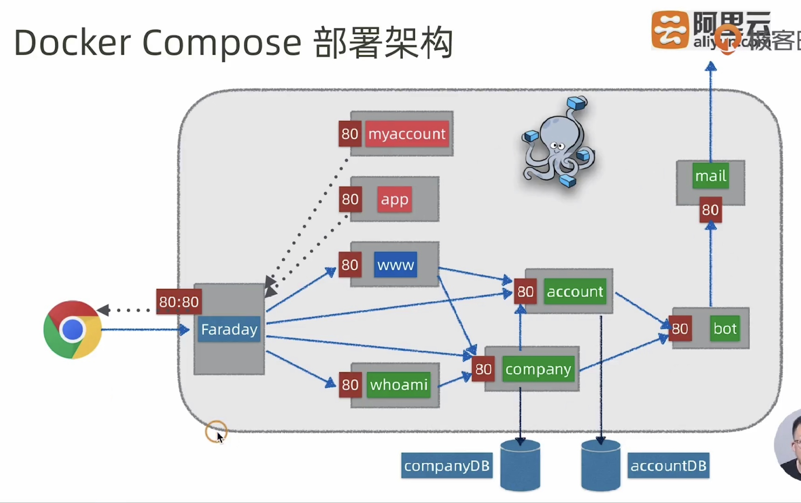
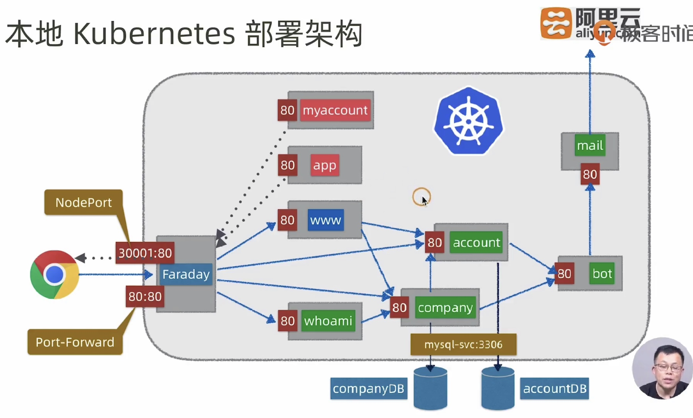
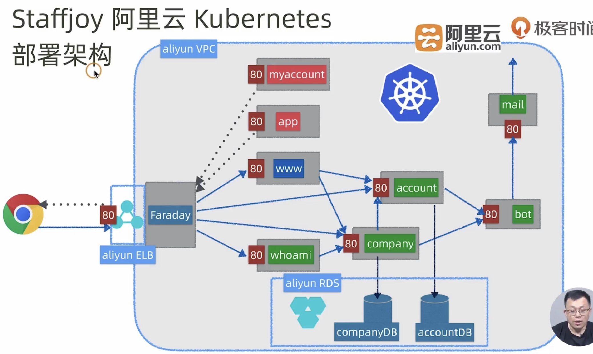

# 部署指南  

# RDS 准备  
1. 创建```account-svc```、```company-svc```项目数据库及表
2. 修改```application-dev.yml``` 配置文件  
3. ```config``` 目录根据example创建```application.yml```配置文件，用来存放所有项目的敏感数据 

# 本地开发部署架构  

## 部署架构  
  
## 软件需求     
+ SkyWalking(6.1.0)  
    + https://github.com/apache/skywalking/releases  
    + https://github.com/apache/skywalking/blob/master/docs/en/setup/service-agent/java-agent/README.md  
+ 本机hosts修改 
    ```
    127.0.0.1 faraday.staffjoy-v2.local
    
    127.0.0.1 account.staffjoy-v2.local
    127.0.0.1 company.staffjoy-v2.local
    127.0.0.1 ical.staffjoy-v2.local
    127.0.0.1 whoami.staffjoy-v2.local
    127.0.0.1 superpowers.staffjoy-v2.local
    127.0.0.1 www.staffjoy-v2.local
    127.0.0.1 staffjoy-v2.local
    127.0.0.1 myaccount.staffjoy-v2.local
    127.0.0.1 app.staffjoy-v2.local
    ```  
## 部署准备  
1. 部署MySQL数据库  
    database:```staffjoy_account```    
    database:```staffjoy_company```   
2. 部署SkyWalking  
    ```bin/startup.sh```      
3. 部署服务  
    + IDE 设置 skywalking-agent  
        VM options:```-javaagent:D:\library\apache-skywalking-apm-bin\agent\skywalking-agent.jar```  
        Environment Variables:```SW_AGENT_NAME=account-svc```  
4. 部署单页应用  
    ```npm install```  
    ```npm start```  
5. 使本地hosts生效  

# docker-compose 部署  

## 部署架构   
   
   
## 软件需求  
    Docker Desktop for Mac/Win  
## 构建和部署  
1. 镜像构建  
    + ```mvn clean package -DskipTests```  进行打包
    + 根据```.env.example```创建```.env```文件来存放```docker-compose```文件所需的敏感数据  
    + 执行```docker-compose conf```命令检查变量是否被填充  
    + ```docker-compose build``` 命令构建镜像      
    + ```docker images```  检查构建后镜像 
2. 部署mysql数据库  
    + database:```staffjoy_account```    
    + database:```staffjoy_company```    
    + 授予ip访问许可(可选)    
3. 部署Staffjoy  
    + ```docker-compose up```  
    + ```docker-compose ps```  
4. 使本地hosts生效  
5. 清理  
    + ```docker-compose down```  
 

# k8s 部署  

## 部署架构  
    
   
# 部署步骤  
1. 准备ConfigMap部署文件  
    +  根据```k8s/test/conf```中的```config.yaml.exanmple```创建```config.yam```文件  
2. 构建镜像  
    + ```mvn clean package -DskipTests```  
    + ```docker-compose build```  
    + ```docker images```  
3. 部署mysql数据库  
    + database:```staffjoy_account```  
    + database:```staffjoy_company```  
    + 授予ip访问许可  
4. 部署Staffjoy(k8s/test)  
    + ```kubectl apply -f confiy.yml```  部署ConfigMap  
    + ```kubectl apply -f test```  部署Staffjoy  
5. 端口转发  
    + 查看faraday pod名:```kubectl get pods```  
    + 端口转发:```kubectl port-forward <faraday-pod-url> 80:80 ```  
    
6. 命令校验  
    + ```kubectl get pods -o wide```  
    + ```kubectl get services```  
    + ```kubectl get deployments```  
7. 清理  
    + ```kubectl delete pods```
    + ```kubectl delete services```
    + ```kubectl delete deployments```  
